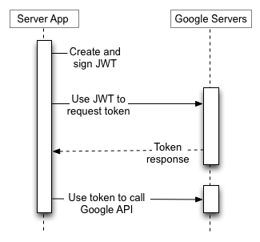
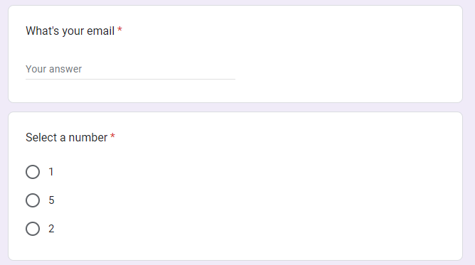
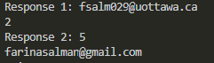
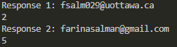

# Google Forms API Research Results

Part of this research includes getting the [API Set Up](#set-up), and results of [polling](#polling-the-form) and [watching](#watching-the-form) the form.

## Set Up
To be able to use the Google Forms API, you need to set up an OAuth 2.0 two-legged flow. This is because Google APIs need a 

To be able to use the Google API, here are the instructions. These instructions facilitate the following process:



1. Set up a Google Email through which we can set up a Google Cloud account. 
2. Set up a Google Cloud Project following this guide:
https://developers.google.com/workspace/guides/create-project
3. Enable the Google Forms API for this project, following this guide:
https://cloud.google.com/endpoints/docs/openapi/enable-api#enabling_an_api
4. Set up a service account, following this guide: https://support.google.com/a/answer/7378726?hl=en
5. Add the generated json file to the ```vsn-backend``` folder, with the name ```client_secret.json```
6. Create a Google Form
7. The service account created has an associated email. Provide this email address access to the Google Form
8. Add the form id to a .env file and call it ```FORM_ID```. The form id can found from the URL: ```https://docs.google.com/forms/d/{FORM_ID}/edit```
9. Run using ```go run main.go```

## Watching the Form
The Google Forms API has Forms API Watches that allow application to subscribe to Cloud Pub/Sub notifications. With this, we are able to be informed for two event types:
* Changes to form content/settings
* Form responses submitted

While this is exactly what we want, Google Cloud Pub/Sub notifications are not free. For more information on pricing, refer to the following: https://cloud.google.com/pubsub/pricing


## Polling the Form
There is an example of periodically polling a Google Form as a proof of concept. It can also be configured for when some action has been taken by a user (e.g. polling upon signing in or clicking a button).

| Method | Avg Latency |
| ------ | ----------- |
| ListFormReponses (all form responses) | 0.221 seconds |
| GetFormResponse (single form response) | 0.295 seconds |

### Limitations
For free API users, there are specified quotas we cannot exceed.

| Quotas                              | Limit* |
|-------------------------------------|:-----:|
| Writes per minute                   |  375  |
| Reads per minute                    |  975  |
| Expensive Reads per minute          |  450  |
| Expensive Reads per minute per user |  180  |
| Reads per minute per user           |  390  |
| Writes per minute per user          |  150  |

\*All limits are per project

For polling, the main limit affecting us will be Expensive Reads (used for listing all form responses at once).

### Possible Complications
The results from the form are returned in random order. As an example, this sample form has 2 questions.



When the responses are listed after polling, they are not listed in the order the questions were asked, but in random order. In the screenshots below, we can see somtimes Question 1's response is listed first and sometimes Question 2's response.




We would need to map the responses once we've gotten them to match the questions with the appropriate answers. 